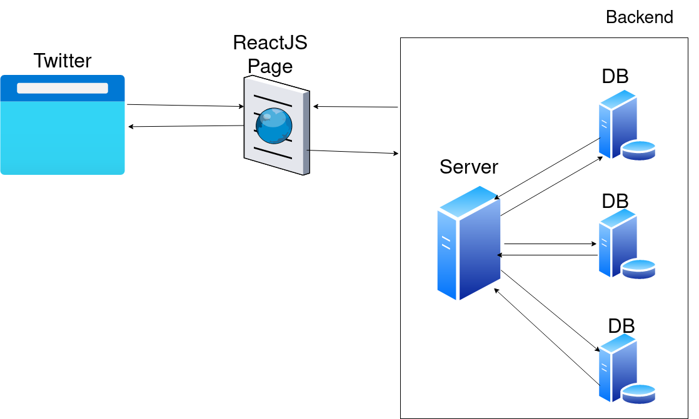
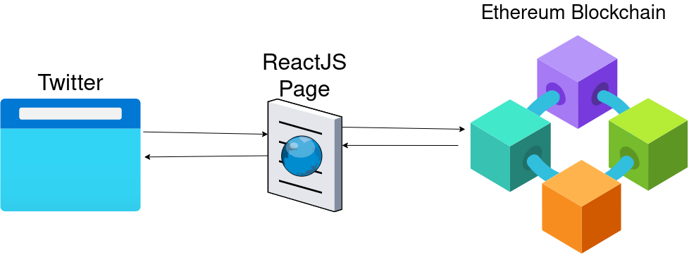
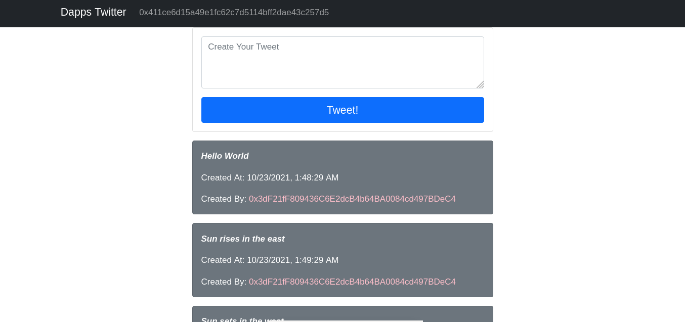

# Building Twitter again with solidity;


## Introduction

In this series, we will create a twitter-like decentralized application that will run without a centralized server and will run on the ethereum blockchain. It is 2 part series in which we are on the first series where we will learn how to create a smart contract in solidity for Decentralize Twitter and connect with a UI using Reactjs Library. 

Prerequisite for this series is solidity and a bit of knowledge about how the ethereum ecosystem works.
 
Let's get to fundamentals about How Twitter works in real life.



When you hit https://twitter.com on the URL bar, It goes to the Twitter Server and shares a ReactJs page from public cloud storage resources available in Twitter's datacenter to you on your browser which is compiled then with javascript engine and rendered on your screen. And according to your preferences, use the functionality and features of Twitter with proper authorization. But what is the problem with the traditional method of sharing and receiving data from Twitter?

The problem is with our data and its privacy policy. When we signup on Twitter, we agree with their Terms and Condition which states informal that they will share our data with 3rd party app which is not known to the General Public and us. We need to comprise our trust with Twitter. So there is not enough trust build with Twitter because we don't know what the heck they are doing with our data. Do you have heard about big tech data breaches?

Let's Deep Dive into Twitter's Decentralized Application that we are going to build. 



<b>Now we need to ask some big and universal questions! How decentralization will help to solve the major issues above listed? And how the second diagram will solve the problem?</b>

This question will be staying along with our journey and will be answered by us in the last section by doing and understanding it.

In our Dapp that will be built by us in this series, we will use the ethereum blockchain network (specially Goerli network for testing and will be deployed on Msainnet network in Series 2 with ENS domain (ENS stands for Ethereum Name System which is not officially naming service for ethereum but ENS is built upon the Ethereum Network. ENS provides secure and smart lookup name address for smart contracts. You can learn more about [ENS](https://ens.domains/))

## Intro to Solidity

***Solidity is an object-oriented programming language for writing smart contracts. It is used for implementing smart contracts on various blockchain platforms, most notably, Ethereum.***
<p align="right">- Wikipedia</p>

Solidity is an advanced programming language for implementing smart contracts on EVM (Ethereum Virtual Machine). It is highly influenced by Javascript, C++, Python and was created by Gavin Wood. It is a statically typed language where variables are explicitly declared. 
<p></p>
Solidity itself cannot be understood by Ethereum Virtual Machine, thus converted into EVM assembly or low-level byte code. There are other languages for interacting with EVM like Vyper, LLL, eWasm, and Huff, etc.

Let's get started in building our Twitter's Smart Contract

## Getting Environment Ready 
We will write our solidity code on web IDE provided by ethereum foundation which can be found on [Remix IDE](https://remix.ethereum.org) or you can download the Remix IDE on your system from Github [Download Remix IDE for System](https://github.com/ethereum/remix-desktop/releases).

After going to Web Remix IDE or installing Remix IDE on System, you can create a Solidity File called Twitter.sol in your workspace section .
	


Let's Start the coding section of our smart contract for Twitter Dapp. 

Attach an SPDX License to the heading of your contract by a comment indicating the license.

```
//SPDX-License-Identifier: MIT
```
You can include a specific license according to the trust you want to build in smart contract. The SPDX Licensing System in source code is for describing your smart contract or solidity code about copyright issues. If you don't want to attach a license then you can specify the value ```UNLICENSED```. More information about SPDX License System is on the SPDX website. You can visit here [SPDX](https://spdx.dev/). The List of License supported by SPDX is on the SPDX website [License List](https://spdx.org/licenses/).

Now we need to touch the compiler versioning of the solidity code.

```
pragma solidity = 0.8.9;
```
At the start of the solidity code, we need to define the compiler version of solidity which will be helpful for getting the latest syntax and generating abi and bytecode. (ABI stands for Application Binary Interface which allows interaction with solidity outside the ethereum blockchain network. It is mainly helpful for UI which tends to invoke the contract method and properties. Bytecode are those op (operation code) code that is actually deployed on the ethereum blockchain network). The pragma keyword is used to tell the compiler about the version it needs to use and compile to this code with following solidity keyword and specific value set by us like above we set the latest version 0.8.9.
  
A contract in Solidity code is a collection of codes that have a specific address on Ethereum Blockchain. It is defined by 
```
contract Twitter{}
``` 

## Structure of Tweet
<b>If you have experience with C/C++ programming language then it will be easy to code in Solidity because Solidity and C/C++ are both statically typed language and solidity borrow some syntax from C/C++.</b>

A Dapp Twitter is made by Tweets which is Tweeted by a different user. We can define our structure of Tweet in solidity by 
```
struct Tweet{}
```


Here we have given a basic structure of Tweet that doesn't contain any information about the tweet. For that, we need to define some basic structure of data that contains information about Tweet. We can have four information resources like tweet body, a unique hash for that tweet, a time when the tweet was created, and the owner of the tweet.

```
struct Tweet{
    string body;
    bytes32 hash;
    uint time;
    address tweeter;
}
```
Let's Break into pieces. ```string body``` defines the tweet of the body which is a string, ```bytes32 hash``` is a unique hash generated at the time of the creation of tweet. It will help to index the tweet easily from the database. ```uint time``` is a time variable that can store an unsigned integer up to 2^256-1 but here it will store a UNIX timestamp (UNIX timestamp is a way to track the time in running total of seconds from January 1, 1970). ```address tweeter``` is an address variable that stores a 40 hexadecimal character long followed by ```0x``` which is also known as a unique account address created by Wallet.

## Creating Tweet's collection and more
After we have defined the structure of Tweet. We need to create a database that contains all the Tweets created by a different user. 
```
Tweet [] public tweets;
```
Here we have created a Tweet dynamic state array variable that will store all the Tweets. There are three kinds of variables in solidity also said as state, local and global variables. But now we need a hashTable that can store key-value pairs like (unique hash of Tweet => index of Tweet in a database). For creating hashTable, solidity provides a special keyword called mapping which will directly implement the hashTable for storing and reading the data.
```
mapping(bytes32 => uint) hashtoindex;
```
Now we have created a hashTable for mapping our unique hash to the index number of the tweet in ```tweets``` array database. Let's create a constructor which will be used for a different purpose or more specifically will used in Series 2 but for now, let's create an empty constructor by using the ```constructor``` keyword followed by empty parameters and curly braces.
```
constructor(){}
```
For Now, we need to log our created Tweet on the ethereum network or also known as event log which stores tweet descriptions in transaction log. Solidity provides two special keywords called ```event``` which describes what event needs to store and also needs to define in solidity code, ```emit``` keyword is used for invoking an ```event``` which is stored on Transaction Log.

```
event Tweeting(string body, bytes32 hash, uint time, address indexed tweeter);
```
Above Code is the definition of an event that stores the tweet information like body also know as tweet statement, a unique hash of tweet, the time when blockchain recorded the tweet and the wallet which made this tweet.

## Creating Tweet on the ethereum blockchain
We will write a function that takes a string argument and return a true variable if the tweet is successfully created.

```
function createTweet(string memory _body) public returns(bool success){}
```
The above code states that there is a function named `createTweet` which takes a string as a parameter and is also available publicly that could be called with the Contract and returns a true variable as return type. Let's write some more code onto the `createTweet` function for creating Tweet on the ethereum blockchain network and logging the `Tweeting` event that was created in chapter 5.

```
function createTweet(string memory _body) public returns(bool success){
    uint time = block.timestamp;
    bytes32 hash = keccak256(abi.encodePacked(_body,msg.sender,time));
    hashtoindex[hash] = tweets.length;
    Tweet memory _temporaryTweet;
    _temporaryTweet.body = _body;
    _temporaryTweet.hash = hash;
    _temporaryTweet.time = time;
    _temporaryTweet.tweeter = msg.sender;
    tweets.push(_temporaryTweet);
    emit Tweetting(temp.body,temp.hash,temp.time,temp.tweeter);
    return true;
}
```
In the createTweet function, there is an unsigned variable named `time` which takes the Transaction created time as a UNIX timestamp in its value. A `hash` variable is created which is a  derive primitive type of bytes32 which holds 32 bytes. `hash` variable takes a invoke nested function return.

`keccak256` is a function that computes the Keccak-256 hash of the input. It gives a signature hash of the input data.  <b>`keccak256` shouldn't be confused with sha256. They Both are relatively the same.</b>

`keccak256` takes another function as input. `abi.encodePacked` takes a list of different data types and return bytes of memory. `abi.encodePacked` performs packed encoding (Packed Encoding also called ASN.1 which takes any kind of data types or cross-platform data and return a single encoded data.) `abi.encodePacked` gives an ambiguous encoding which doesn't mean for anything. 

We call the mapping variable created in chapter 5 `hashtoindex` that takes a key as the hash of the tweet and makes a pair with the length of the tweets variable. Why do we create `hashtoindex` mapping variable? We will know in the next chapter. We named a variable `_temporaryTweet` that is a local variable and doesn't store in the blockchain network. The purpose of `_temporaryTweet` variable is to store the data of creating Tweet types. While we assigned the complete data respectively to the temporary Tweet variable we created and also pushed the temporary Tweet variable to the state variable `tweets`, we need to invoke the event Tweeting to make a Transaction log on this current Transaction. For that, we need to invoke by keyword `emit` following the event name define in chapter five called Tweeting by passing down the exact order of data. At Last, we need to return true because we have successfully created a tweet in the `tweets` state array variable like database and made a Transaction Log on the Transaction block that a Tweet had been created so at then end we listed ```return true```.

## Getting the Tweet which is recorded on the ethereum blockchain network
For reading the tweets from the ethereum blockchain network. We are creating two function named ```getAllTweets``` and ```getTweetsByUser```.

```
function getAllTweets() public view returns(Tweet [] memory){
    return tweets;
}
```
We have created a `getAllTweets` that takes no parameter that is a public function, which can be called with the contract itself and have a view modifier which means no state variable will be modified and can ready the state variable and will return Tweet array variable which is created to store all the Tweet. At the end of `getAllTweets` function, the function returns the tweets state variable which acts as a database for this contract.

```
 function getTweetByUser(address _senter) public view returns(Tweet [] memory){
        uint totalCounts;
        for(uint a = 0; a <= tweets.length-1; a++){
            if(tweets[a].tweeter == _senter){
                totalCounts += 1;
            }
        }
        Tweet [] memory _tweet = new Tweet[](totalCounts);
        uint j;
        for(uint a = 0; a <= tweets.length-1; a++){
            if(Tweets[a].tweeter == _senter){
                _tweet[j] = tweets[a];
                j += 1;
            }
        }
        return _tweet;
    }
}
```
In `getTweetByUser` function we took a parameter as a tweeter address which will then an array of Tweet, the tweeter created. There are 2 for looping in the function in which the first one counts the number of tweets the sender had created and makes a temporary static or fixed array named `_tweet` of Tweet data types. The second for loops is for the assignment of the tweet to the temporary variable created as `__tweet` and at last, it returns the temporary variable by fulfilling the return type as expected.

## Final Source Code
Here is your final Source code for this first series of Twitter Dapps.
```
//SPDX-License-Identifier: MIT
pragma solidity = 0.8.9;
contract Twitter{
    struct Tweet{
        string body;
        bytes32 hash;
        uint time;
        address tweeter;
    }
    Tweet [] public tweets;
    mapping(bytes32 => uint) hashtoindex;
    constructor(){}
    event Tweeting(string body, bytes32 hash, uint time, address indexed tweeter);
    function createTweet(string memory _body) public returns(bool success){
        uint time = block.timestamp;
        bytes32 hash = keccak256(abi.encodePacked(_body,msg.sender,time));
        hashtoindex[hash] = tweets.length;
        Tweet memory _temporaryTweet;
        _temporaryTweet.body = _body;
        _temporaryTweet.hash = hash;
        _temporaryTweet.time = time;
        _temporaryTweet.tweeter = msg.sender;
        tweets.push(_temporaryTweet);
        emit Tweeting(_temporaryTweet.body, _temporaryTweet.hash,_temporaryTweet.time,_temporaryTweet.tweeter);
        return true;
    }
    function getAllTweets() public view returns(Tweet [] memory){
        return tweets;
    }
    function getTweetByUser(address _senter) public view returns(Tweet [] memory){
        uint totalCounts;
        for(uint a = 0; a <= tweets.length-1; a++){
            if(tweets[a].tweeter == _senter){
                totalCounts += 1;
            }
        }
        Tweet [] memory _tweet = new Tweet[](totalCounts);
        uint j;
        for(uint a = 0; a <= tweets.length-1; a++){
            if(tweets[a].tweeter == _senter){
                _tweet[j] = tweets[a];
                j += 1;
            }
        }
        return _tweet;
    }
}
```
## Deploying the Contract on Network
Now we are at the final stage of deploying our simple Twitter-like smart contract on the preferable network. I will deploy on Goerli Network will use Remix IDE and using injected web3 like Metamask. You can also choose hardhat, truffle, or your favorite library that can interact with global ethereum blockchain network like mainnet or testnet like Goerli, Kovan, or Ropsten Network.  

You can see the contract on etherscan goerli network Page [Twitter Etherscan](https://goerli.etherscan.io/address/0x2ae08a2ed68F4262D1Bb6E5C00A5Dd6a0292e2Bf)

Let's Play with UI and make it a simple Twitter like Dapp. For UI visit to my github page and clone the git repositories and run the command `yarn install` to install the dependencies and devdependencies and at last run `yarn start`. You will see the below like feature on your Screen.

[Github Repo](https://github.com/nativeanish/twitterdapps)





## End
Now we are at the end of this series one. Hope you enjoy the first series by creating a smart contract and playing with the UI. 

What we are going to do in series two? 

(1) Adding more features like a retweet, setting up Twitter handle username, uploading your profile picture, sending a personal message to any user, searching user by username, and adding a like button to each tweet.

(2) We need major improvement in UI. (I will change the CSS library from Bootstrap Framework to Tailwind CSS utility Library that will enhance the UI and UX. If you have some suggestions about UI or design then please DM)

(3) Getting some real and hard stuff done like gas optimization and interacting with inline assembly or bytecode

(4) Writing Test scripts

(5) Deploying on Mainnet and with custom ens domain

<b>If you have any suggestion or change you think it should be made then you can make a pull request or DM me on Github or Discord </b>
