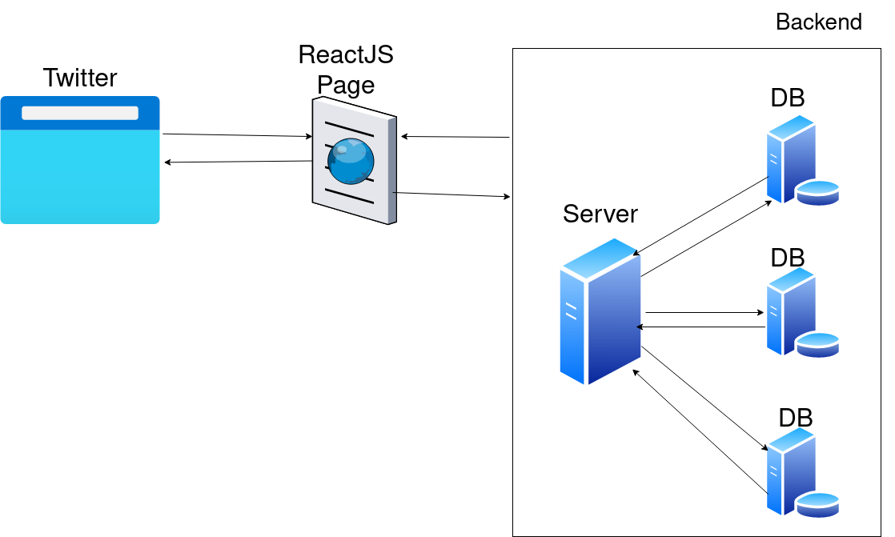

# Introduction

In this series, we will create a twitter-like decentralized application that will run without a centralized server and will run on the ethereum blockchain. It is 2 part series in which we are on the first series where we will learn how to create a smart contract in solidity for Decentralize Twitter and connect with a UI using Reactjs Library. 

Prerequisite for this series is solidity and a bit of knowledge about how the ethereum ecosystem works.
 
Let's get to fundamentals about How Twitter works in real life.

When you hit https://twitter.com on the URL bar, It goes to the Twitter Server and shares a ReactJs page from public cloud storage resources available in Twitter's datacenter to you on your browser which is compiled then with javascript engine and rendered on your screen. And according to your preferences, use the functionality and features of Twitter with proper authorization. But what is the problem with the traditional method of sharing and receiving data from Twitter?

The problem is with our data and its privacy policy. When we signup on Twitter, we agree with their Terms and Condition which states informal that they will share our data with 3rd party app which is not known to the General Public and us. We need to comprise our trust with Twitter. So there is not enough trust build with Twitter because we don't know what the heck they are doing with our data. Do you have heard about big tech data breaches?

Let's Deep Dive into Twitter's Decentralized Application that we are going to build. 

<b>Now we need to ask some big and universal questions! How decentralization will help to solve the major issues above listed? And how the second diagram will solve the problem?</b>

This question will be staying along with our journey and will be answered by us in the last section by doing and understanding it.

In our Dapp that will be built by us in this series, we will use the ethereum blockchain network (specially Goerli network for testing and will be deployed on Msainnet network in Series 2 with ENS domain (ENS stands for Ethereum Name System which is not officially naming service for ethereum but ENS is built upon the Ethereum Network. ENS provides secure and smart lookup name address for smart contracts. You can learn more about [ENS](https://ens.domains/))