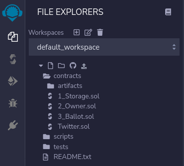

# Getting Environment Ready 
We will write our solidity code on web IDE provided by ethereum foundation which can be found on [Remix IDE](https://remix.ethereum.org) or you can download the Remix IDE on your system from Github [Download Remix IDE for System](https://github.com/ethereum/remix-desktop/releases).

After going to Web Remix IDE or installing Remix IDE on System, you can create a Solidity File called Twitter.sol in your workspace section .
	


Let's Start the coding section of our smart contract for Twitter Dapp. 

Attach an SPDX License to the heading of your contract by a comment indicating the license.

```
//SPDX-License-Identifier: MIT
```
You can include a specific license according to the trust you want to build in smart contract. The SPDX Licensing System in source code is for describing your smart contract or solidity code about copyright issues. If you don't want to attach a license then you can specify the value ```UNLICENSED```. More information about SPDX License System is on the SPDX website. You can visit here [SPDX](https://spdx.dev/). The List of License supported by SPDX is on the SPDX website [License List](https://spdx.org/licenses/).

Now we need to touch the compiler versioning of the solidity code.

```
pragma solidity = 0.8.9;
```
At the start of the solidity code, we need to define the compiler version of solidity which will be helpful for getting the latest syntax and generating abi and bytecode. (ABI stands for Application Binary Interface which allows interaction with solidity outside the ethereum blockchain network. It is mainly helpful for UI which tends to invoke the contract method and properties. Bytecode are those op (operation code) code that is actually deployed on the ethereum blockchain network). The pragma keyword is used to tell the compiler about the version it needs to use and compile to this code with following solidity keyword and specific value set by us like above we set the latest version 0.8.9.
  
A contract in Solidity code is a collection of codes that have a specific address on Ethereum Blockchain. It is defined by 
```
contract Twitter{}
``` 