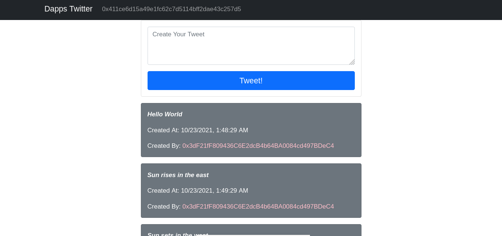

# Deploying the Contract on Network
Now we are at the final stage of deploying our simple Twitter-like smart contract on the preferable network. I will deploy on Goerli Network will use Remix IDE and using injected web3 like Metamask. You can also choose hardhat, truffle, or your favorite library that can interact with global ethereum blockchain network like mainnet or testnet like Goerli, Kovan, or Ropsten Network.  

You can see the contract on etherscan goerli network Page [Twitter Etherscan](https://goerli.etherscan.io/address/0x2ae08a2ed68F4262D1Bb6E5C00A5Dd6a0292e2Bf)

Let's Play with UI and make it a simple Twitter like Dapp. For UI visit to my github page and clone the git repositories and run the command `yarn install` to install the dependencies and devdependencies and at last run `yarn start`. You will see the below like feature on your Screen.

[Github Repo](https://github.com/nativeanish/twitterdapps)

